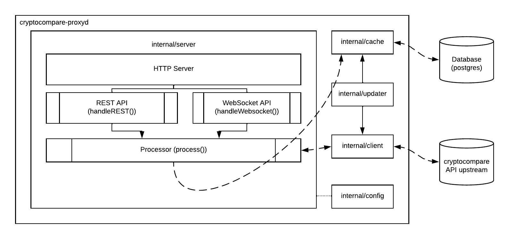

## cryptocompare-proxyd

The reverse proxy for cryptocompare.

Works in two modes:
* read-write (default): reads data from the cache storage, updates the data in the cache storage.
* read-only: reads data from the cache storage, doesn't do any updates on its own but can still
    receive actual data from the upstream.

# Architecture



## Prerequisites

* Go
* Task ([https://taskfile.dev/](taskfile.dev))
* Docker (or just a standalone postgres instance running somewhere)

## Cache

Start the cache storage (postgres) by running `task postgres` or by starting postgres manually.

## Configuration

The program works great in a zero-configuration manner, but still supports lots of tweaks:

The configuration can be read from a YAML file (`/etc/cryptocompare-proxyd.conf` by default) or by specifying environment variables.

* Listen Address is an address to listen for HTTP connections on.

    YAML: `listen_address`

    Environment: `LISTEN_ADDRESS`

    Default: `:8080`

* Update Interval is a duration of time (seconds) which should be used for refreshing cached data from the cryptocompare service.
	Note that the cryptocompare service caches data itself, the ttl is 10
	seconds, so there is not much sense to assign this value to less than 10
	seconds.

    YAML: `update_interval`

    Environment: `UPDATE_INTERVAL`

    Default: `30`

* CacheTTL is a duration of time (seconds) to treat cache entries as expired.

    YAML: `cache_ttl`

    Environment: `CACHE_TTL`

    Default: `120`

* Fsyms is a cryptocurrency symbols of interest.

    YAML: `fsyms,inline`

    Environment: `FSYMS`

    Default: `[BTC]`

* Tsyms is a cryptocurrency symbols list to convert into.

    YAML: `tsyms`

    Environment: `TSYMS`

    Default: `[USD]`

* Database Address is an address of a database to connect to.

    YAML: `database_address`

    Environment: `DATABASE_ADDRESS`

    Default: `localhost:5432`

* Database Name is a name of database the program should talk with.

    YAML: `database_name`

    Environment: `DATABASE_NAME`

    Default: `cryptocompare-proxyd-dev`

* Database Username is a username that should be used to auth in the database.

    YAML: `database_username`

    Environment: `DATABASE_USERNAME`

    Default: `cryptocompare-proxyd-dev`

* DatabasePassword is a password that should be used to auth in the database.

    YAML: `database_password`

    Environment: `DATABASE_PASSWORD`

    Default: `cryptocompare-proxyd-dev`

## Running

### Development

Default development mode to start the application: `task run`

Read-only development mode to start the application: `task run-readonly`

### Docker

The docker image is accessible at kovetskiy/cryptocompare-proxyd, make sure to connect it to the
postgres instance by creating a Docker network and connecting both containers to the network.
```
docker run -it -p 8080:8081 -p 8081:8081 --network cryptocompare-proxyd kovetskiy/cryptocompare-proxyd --debug
```


# Motivation behind the read-only mode

Read-only mode allows to scale read-only instances easier while having small amount of instances
that write data into the cache storage since it doesn't need to be populated that often.

# License

MIT
